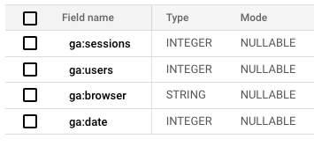
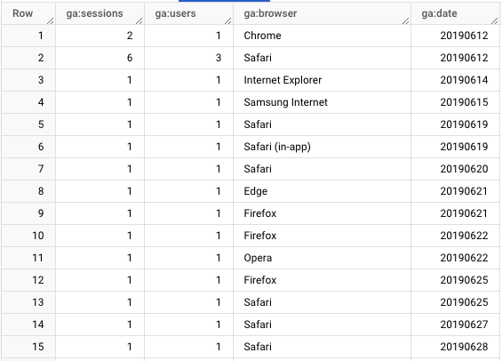

# Google Analytics (Universal) to BigQuery Data Pipeline
This Python script provides a proof-of-concept for transferring data from Google Analytics Universal (GAU) to a BigQuery table.

## Step I - Data Extraction
The script fetches a report with specified metrics and dimensions from a [GAU using Google Analytics Reporting API v4](https://developers.google.com/analytics/devguides/reporting/core/v4). GA report requests consist of multiple fields. For the brevity, we are going to go over two fields: dimensions and metrics.
#### Understanding GA Dimensions & Metrics:
In Google Analytics, dimensions describe the characteristics of your data (e.g., date, browser, location), while metrics are quantitative measurements (e.g., users, sessions, pageviews). With solely metrics, you can only get a summary of your data over a fixed date range, such as the total number of sessions in the past month. However, this doesn't provide the depth needed for actionable insights. To uncover trends, identify user segments, and understand how metrics vary across different dimensions (e.g., traffic trends over time, user demographics, channel performance), you need to combine metrics with dimensions. 

Below is the request body used in the script:
```
{
    'reportRequests': [
    {
        'viewId': VIEW_ID,
        'dateRanges': [{'startDate': '2019-06-10', 'endDate': '2019-12-31'}],
        'metrics': [{'expression': 'ga:users'},
                    {'expression':'ga:sessions'}],
        'dimensions': [{'name': 'ga:date'}, {'name': 'ga:browser'}]
    }]
}
```
'viewId' is the id of your Google Analytics view that you want to get your data from. It can be found under Admin - Account | Property | View

'dateRanges' is the range of dates to pull the data from in Google Analytics.

In this report, two metrics were specified: 'ga:users' and 'ga:sessions' with two dimensions: 'ga:date' and 'ga:browser'. Those fields will produce a report that will give us information about users and sessions broken down by the browser type for each day specified in the dateRanges. 

## Step II - Data Transformation: 

* Parse the API response into a structured format as a list of dictionaries. Each dictionary represents a BigQuery table row.
* Convert the list into JSON. 
* Load JSON data into pandas DataFrame. I chose this step to avoid converting regular JSON format into a newline delimited JSON. BigQuery expects that type and won't accept the regular JSON format.

## Step III - Loading: 
Appends the extracted data to a BigQuery table using the pandas-gbq library.

```
pandas_gbq.to_gbq(df, 'ga_to_bq.u_b_c', project_id='data-engineering-390014',
                  if_exists = 'append')

```

## Prerequisites:
1. Google Cloud Project: Ensure you have a Google Cloud Project with BigQuery enabled.
2. Service Accounts with:
    * One with "Read & Analyze" permissions in Google Analytics. Download its JSON key file.
    * One with "BigQuery Job User" permissions. Download its JSON key file.
3. Python 3.x with the following libraries installed:

    ```
    Bash

    pip install google-api-python-client google-auth-httplib2 google-auth google-cloud-bigquery pandas pandas-gbq
    ```
4. BigQuery Table: Create the target BigQuery table.


> [!NOTE]
> Ensure the schema matches the report data structure returned by the API.


Below is the example of the schema I used to store the data pulled from the requests: 




That's what data looks like in the BigQuery:



## Technologies

Python, Google Analytics, BigQuery, pandas, Jupyter Notebooks. 


